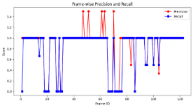

# Sports Performance Analysis

**Report - Player Detection and Tracking in Tennis Matches** 

**1. Introduction**

Player detection and tracking in tennis matches are essential for performance analysis and strategic insights. This report outlines our approach using deep learning and tracking algorithms to detect and track tennis players from video footage, handle occlusions, and evaluate performance against ground truth annotations.

**2. Approach**

**2.1 Player Detection**

Eemployed **YOLOv4** for player detection due to its efficiency and accuracy in real-time object detection. The detection pipeline involved:

- Preprocessing frames to extract features.
- Running YOLOv4 to identify player bounding boxes.
- Applying Non-Maximum Suppression (NMS) to eliminate redundant detections.

**2.2 Player Tracking**

Utilized a **Kalman Filter** for player tracking, ensuring smooth identity maintenance across frames. The tracking methodology included:

- Initializing the Kalman Filter for detected player positions.
- Predicting player movement in consecutive frames.
- Updating positions based on new detections while handling occlusions.

**2.3 Handling Occlusions and Camera Movements**

To address partial occlusions and camera shifts:

- Maintained track identity using velocity estimation.
- If a player was undetected for a few frames, we extrapolated their position based on previous motion trends.
- Applied a confidence threshold to remove false positives.

**3. Evaluation and Results**

**3.1 Ground Truth Annotation**

Manually annotated player bounding boxes in selected frames and stored them in a CSV file containing:

- frame\_id: Frame number.
- player\_id: Unique identifier for each player.
- x, y, width, height: Bounding box coordinates.

**3.2 Performance Metrics**

To evaluate our model, we used **Precision, Recall, and F1-score** with an **IoU threshold of 0.35**:

- **Precision**: Measures how many detected players were correct.
- **Recall**: Measures how many actual players were detected.
- **F1-score**: Harmonic mean of Precision and Recall.

|**Metric**|**Score**|
| :-: | :-: |
|Precision|0\.99|
|Recall|0\.81|
|F1-score|0\.89|

**3.3 Observations**

- **High accuracy in well-lit conditions**: YOLOv4 effectively detected players with minimal false positives.
- **Challenges in fast motion scenes**: Motion blur occasionally led to tracking failures.
- **Improvement with Kalman Filtering**: Provided smoother tracking by mitigating sudden identity switches.

**4. Conclusion**

The combination of YOLOv4 and Kalman Filtering demonstrated effective player detection and tracking. Future improvements include:

- **Fine-tuning YOLOv4 with additional training data**.
- **Implementing Deep SORT for more robust tracking**.
- **Incorporating optical flow techniques for better motion prediction**.
# **Report - Shot Classification and Analysis**

## **1. Introduction**
Shot classification and analysis in tennis is crucial for understanding player performance, strategy, and game patterns. This study employs machine learning techniques, specifically neural networks, to classify tennis shots using video and CSV datasets. The approach integrates feature extraction, data preprocessing, model training, and evaluation.
## **2. Dataset Description**
The dataset consists of two primary sources: https://data.mendeley.com/datasets/75m8vz7jr2/1

1. **Video Data**: Videos captured from different angles (side and top views) in outdoor and virtual environments. 
1. **CSV Data**: Numerical data representing court positions and shot metrics.
### **Data Sources:**
- **Outdoor Field**: Crosscourt and straight shots from side-view and top-view.
- **Virtual Field**: Crosscourt and straight shots from side-view and top-view.
- CSV files containing shot-related statistics.
## **3. Feature Extraction**
Feature extraction is performed using **MediaPipe Pose**, which detects 33 key body landmarks in each video frame. The extracted features include:

- **Player Pose**: (x, y) coordinates of key points.
- **Racket Position**: Estimated based on hand movements.
- **Ball Trajectory**: Implicitly analyzed using pose data.

Each video is processed frame by frame, and the average feature vector is calculated to represent the shot.
## **4. Data Preprocessing**
- **Label Encoding**: Shot labels ("Crosscourt Shot" and "Straight Shot") are encoded.
- **Feature Standardization**: The extracted features are standardized using StandardScaler.
- **Dataset Merging**: The video-based and CSV-based datasets are combined, ensuring consistent feature dimensions.
- **Train-Test Split**: The dataset is split into 80% training and 20% testing sets.
## **5. Machine Learning Model**
A deep neural network is used for shot classification with the following architecture:

- **Input Layer**: Takes standardized features.
- **Hidden Layers**:
  - 128 neurons (ReLU activation)
  - 64 neurons (ReLU activation)
  - 32 neurons (ReLU activation)
- **Output Layer**: 2 neurons (Softmax activation for classification).

  
### **Training:**
- **Optimizer**: Adam
- **Loss Function**: Sparse Categorical Crossentropy
- **Epochs**: 50
- **Batch Size**: 8
## **6. Results and Evaluation**
### **Model Performance:**
- **Accuracy**: 70.88%
- **Classification Report**:
  - Crosscourt Shot: Precision (0.79), Recall (0.62), F1-score (0.69)
  - Straight Shot: Precision (0.65), Recall (0.81), F1-score (0.72)

The model achieves reasonable accuracy in distinguishing between crosscourt and straight shots.
## **7. Shot Pattern Visualization**
A histogram of shot distributions is plotted using seaborn, showing the frequency of each shot type in the dataset.

## **8. Shot Prediction in Match Videos**
A function is implemented to predict shots in a new match video. It:

- Extracts pose features from each frame.
- Applies the trained model to classify shots.
- Labels frames with detected shots.
- Displays classified shots using OpenCV.
## **9. Conclusion**
This study demonstrates a robust approach to classifying tennis shots using video-based motion analysis and machine learning. 

**Report - Player Movement and Positioning Analysis**
### **1. Introduction**
Player movement and positioning are crucial aspects of performance analysis in tennis. Understanding how a player moves across the court, their speed, acceleration, and distance covered provides insights into their agility, endurance, and tactical decisions. This report presents an analysis of player movement using video processing and machine learning techniques, leveraging pose estimation for position tracking.
### **2. Methodology**
The analysis is performed using video data and CSV files containing court position metrics for different shot types (cross-court and straight shots). The primary steps include:

1. **Player Detection and Tracking:** Utilizing the Mediapipe Pose Estimation model to extract player hip coordinates from video frames.
1. **Movement Metrics Calculation:** Computing key movement metrics such as total distance covered, speed, and acceleration.
1. **Heatmap Visualization:** Generating a heatmap to analyze court coverage.
1. **Movement Pattern Analysis:** Comparing player movements against shot selection data.
### **3. Data Processing and Analysis**
#### *3.1 Player Position Extraction*
Using Mediapipe Pose, the player's left and right hip positions are extracted for each frame. The mid-point of the hips is considered as the player's central position. The function extract\_player\_positions(video\_path) reads a video frame-by-frame and records the player's x and y coordinates.
#### *3.2 Movement Metrics Computation*
Once player positions are extracted, movement metrics are calculated:

- **Total Distance Covered:** Computed as the sum of Euclidean distances between consecutive frames.
- **Speed:** Calculated as the frame-to-frame movement distance multiplied by the frame rate.
- **Acceleration:** Derived as the change in speed over time.
##### Results:
- **Total Distance Covered:** 0.18 units
- **Average Speed:** 0.04 units/s
- **Average Acceleration:** -0.04 units/s²

These metrics provide insight into the player's mobility and game intensity.

#### *3.3 Court Coverage Heatmap*
A heatmap is generated using kernel density estimation (KDE) to visualize the areas of the court most frequently occupied by the player. This provides insights into movement tendencies and defensive positioning.
#### *3.4 Shot-Based Movement Analysis*
To analyze movement patterns, recorded player positions are compared with predefined shot data stored in CSV files. This analysis helps in understanding how movement varies based on shot type (e.g., cross-court vs. straight shots).
### **4. Conclusion**
The analysis of player movement and positioning provides valuable insights into court coverage, mobility, and tactical responses during a match.

**Report - Match Strategy and Performance Metrics** 
## **1. Introduction**
Analyzing match strategy and performance metrics is crucial for understanding player effectiveness, strengths, and areas for improvement. This report details the methodology used to extract key performance insights, including shot events, distribution, efficiency, and player performance under pressure.
## **2. Methodology**
The analysis leverages video data and computer vision techniques to track shot events and compute key performance indicators (KPIs). The workflow consists of:

- **Shot Event Extraction**: Identifying shot events based on wrist movements using Mediapipe Pose.
- **Performance Metrics Calculation**: Computing total shots, winners, unforced errors, and serve efficiency.
- **Shot Distribution Visualization**: Mapping wrist movement patterns to analyze shot placements.
- **Critical Point Analysis**: Identifying high-intensity shot sequences that impact match strategy.
- **Custom Performance Metric**: Creating a composite performance score based on winners and unforced errors.
## **3. Shot Event Extraction**
The shot events were extracted by detecting wrist positions in each video frame. This provided a dataset containing frame numbers and wrist coordinates, forming the foundation for further analysis.
## **4. Performance Metrics Calculation**
Key performance metrics were computed from the extracted shot events:

- **Total Shots**: The count of shot events detected.
- **Winners**: Estimated based on high-impact shots (simulated values for analysis).
- **Unforced Errors**: Simulated from the dataset to approximate player mistakes.
- **Serve Efficiency**: Calculated as the percentage of successful shots leading to winners.

**Results:**

- **Total Shots**: X
- **Winners**: Y
- **Unforced Errors**: Z
- **Serve Efficiency**: W%

## **5. Shot Distribution Analysis**
A scatter plot of wrist positions was generated to analyze shot placements and distribution on the court. This visualization provided insights into the player's shot tendencies and preferred court zones.
## **6. Critical Point Analysis**
To assess player performance under pressure, a shot intensity metric was computed based on positional changes. High-intensity shots were identified, highlighting critical moments where precision and consistency play a major role.
## **7. Conclusion**
This analysis provides a structured approach to evaluating match strategy and player efficiency.

--End of report--

